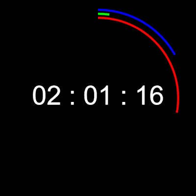

# Simple Clock

**Made with <3 by [mateus.digital](https://mateus.digital).**


<p align="center">
    
</p>

## Description:

Simple Clock is a very basic clock that I created to learn the Canvas drawing API.


You can [check it online](https://mateus.digital/simple_clock).

<br>

As usual, you are **very welcomed** to **share** and **hack** it.


## Building


```bash
git clone https://github.com/mateusdigital/simple_clock
cd simple_clock
./scripts/build-static.sh      ## Builds the webpage for the project.
```

## License:

This software is released under [GPLv3](https://www.gnu.org/licenses/gpl-3.0.en.html).


## Others:

- Email: hello@mateus.digital
- Website: https://mateus.digital
- Itch.io: https://mateusdigital.itch.io
- Linkedin: https://www.linkedin.com/in/mateusdigital
- Twitter: https://www.twitter.com/_mateusdigital
- Youtube: https://www.youtube.com/@_mateusdigital

There's more FLOSS things at [mateus.digital](https://mateus.digital) :)
